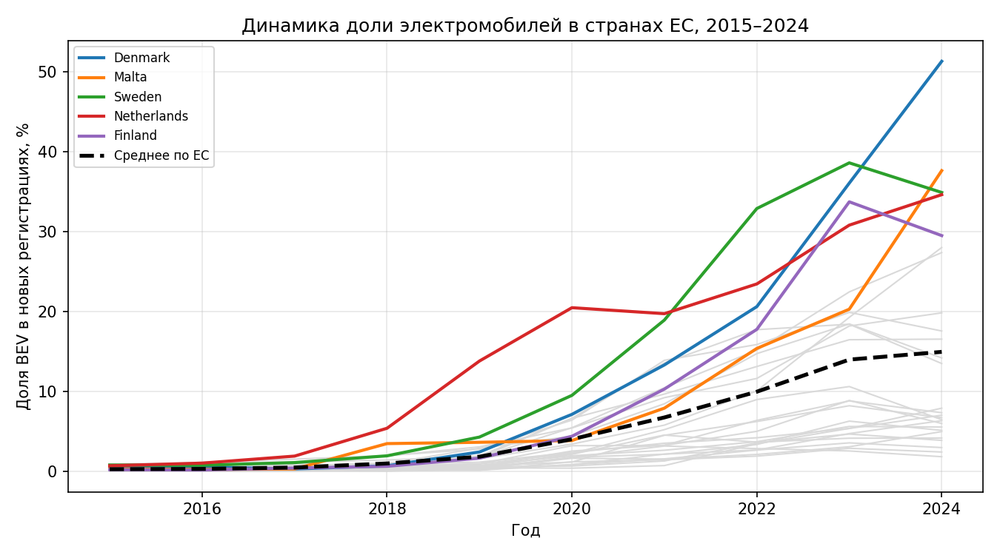
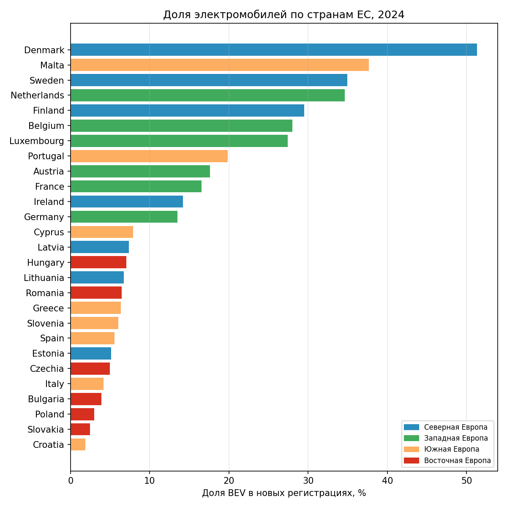
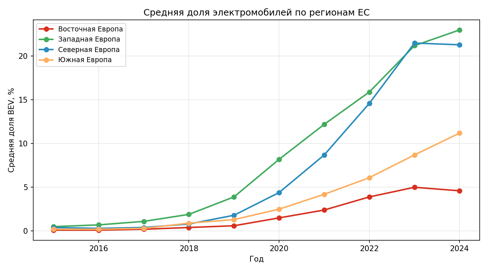
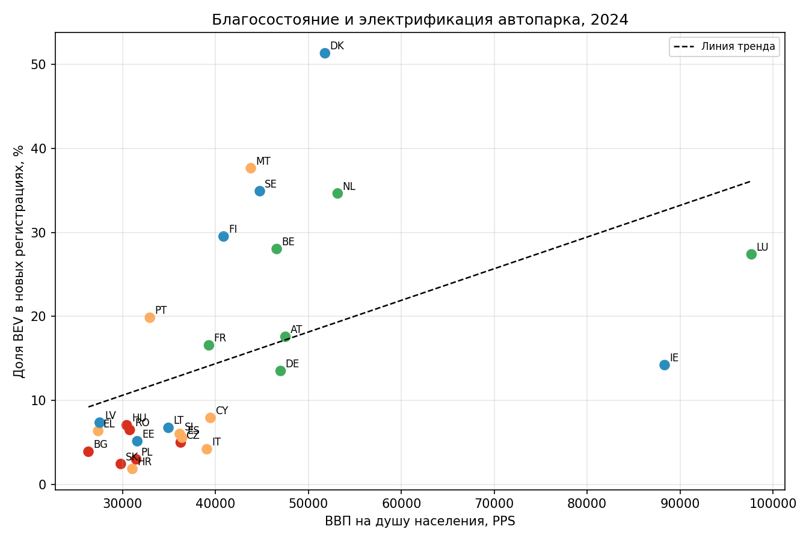
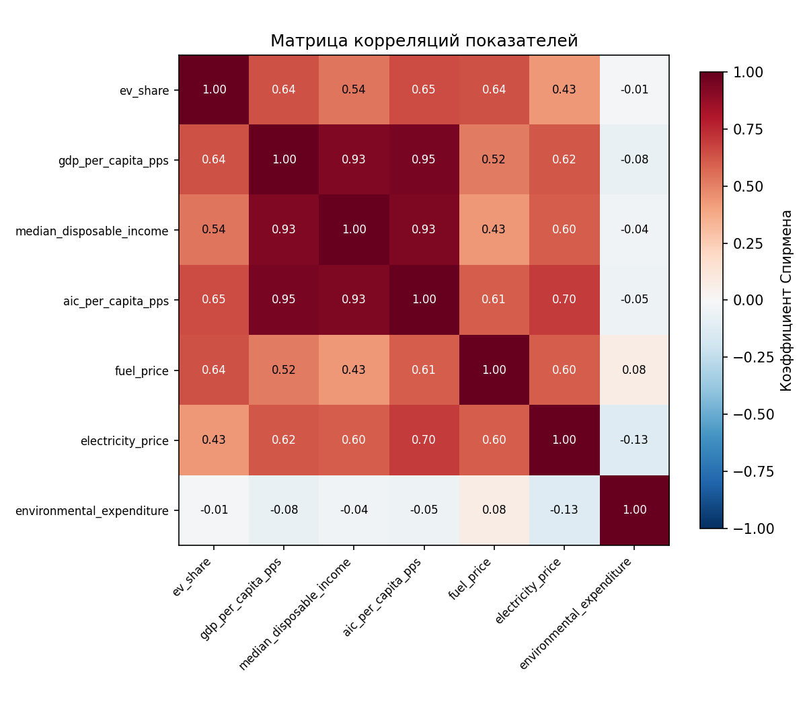
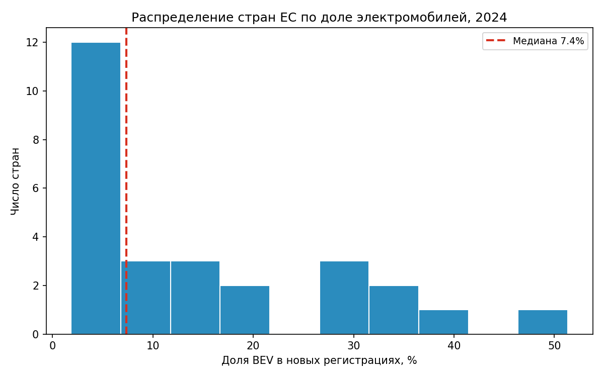

# Взаимосвязь благосостояния и распространения электромобилей в странах ЕС, 2015–2024

## Синопсис

Этот проект — небольшое data-driven исследование взаимосвязи между уровнем благосостояния и распространением электромобилей в странах Европейского союза в 2015–2024 годах.

Основная идея исследования — проверить, наблюдается ли статистическая связь между экономическим положением страны и долей аккумуляторных электромобилей среди новых регистраций легковых автомобилей. Помимо показателей благосостояния, рассматриваются цены на топливо и электроэнергию, численность населения и расходы на охрану окружающей среды.

Исследование построено как полный аналитический цикл: данные собираются из открытых источников через API и загружаемые файлы, очищаются и объединяются в единую панельную таблицу, после чего анализируются с помощью описательной статистики, сравнений, корреляционного и регрессионного анализа. Итоговые графики и результаты сохранены в репозитории.

---

## Актуальность

Переход к электромобилям является одной из заметных тенденций изменения европейского транспортного рынка. Однако распространение электромобилей происходит неодинаково: страны ЕС существенно различаются по уровню доходов, потребительским возможностям, ценам на энергию и топливо, а также по экономическим условиям.

Поэтому возникает вопрос: **связано ли экономическое благосостояние страны с тем, насколько широко в ней распространяются электромобили?**

Ответ на этот вопрос позволяет рассмотреть более общий вопрос о связи между экономическими условиями и распространением новых технологий.

Важно различать два уровня анализа. В данном проекте используются агрегированные данные по странам, поэтому исследование показывает взаимосвязи **между странами и годами**, а не вероятность покупки электромобиля конкретным человеком.

---

## Исследовательские вопросы

1. Как менялось распространение электромобилей в странах ЕС в 2015–2024 годах?
2. Какие различия наблюдаются между странами ЕС?
3. Как распространение электромобилей связано с ВВП на душу населения?
4. Связано ли распространение электромобилей с располагаемым доходом населения?
5. Как связаны распространение электромобилей и цены на автомобильное топливо?
6. Как связаны распространение электромобилей и цены на электроэнергию?
7. Наблюдается ли статистическая связь между распространением электромобилей и расходами на охрану окружающей среды?
8. Сохраняются ли обнаруженные взаимосвязи при одновременном учёте нескольких факторов?

---

# Данные

## Дизайн набора данных

Исследование построено на панельных данных.

**Единица наблюдения: одна страна в один год.**

Ключ наблюдения:

```text
country_code + year
```

В выборке:

- 27 стран ЕС;
- 10 лет;
- 270 наблюдений.

Итоговая таблица имеет формат:

```text
страна × год
```

Очищенные данные находятся в [`data/cleaned/ev_welfare_eu.csv`](data/cleaned/ev_welfare_eu.csv).

Исходные данные хранятся отдельно в директории [`data/raw/`](data/raw/).

Такое разделение позволяет сохранить исходные данные и отдельно хранить версию, подготовленную непосредственно для анализа.

## Переменные

| Переменная | Описание |
|---|---|
| `country_code` | Код страны |
| `country` | Название страны |
| `year` | Год |
| `ev_share` | Доля аккумуляторных электромобилей среди новых регистраций легковых автомобилей |
| `gdp_per_capita_pps` | ВВП на душу населения в стандартах покупательной способности |
| `median_disposable_income` | Медианный эквивалентный располагаемый доход |
| `aic_per_capita_pps` | Фактическое индивидуальное потребление на душу населения в PPS |
| `population` | Численность населения |
| `fuel_price` | Цена автомобильного топлива |
| `electricity_price` | Цена электроэнергии для домохозяйств |
| `environmental_expenditure` | Расходы на охрану окружающей среды |

# Источники данных

## Eurostat

Основная часть социально-экономических, демографических и ценовых данных получена из официальной статистической базы **Eurostat**.

Используются показатели:

- ВВП на душу населения;
- медианный эквивалентный располагаемый доход;
- фактическое индивидуальное потребление;
- численность населения;
- цены на автомобильное топливо;
- цены на электроэнергию;
- расходы на охрану окружающей среды.

Для автоматизированного получения части данных используется **Eurostat API**.

Официальный портал:  
https://ec.europa.eu/eurostat/

Документация API:  
https://ec.europa.eu/eurostat/web/user-guides/data-browser/api-data-access/api-overview

## European Environment Agency

Показатель распространения электромобилей получен из данных **European Environment Agency (EEA)** о новых регистрациях электрических автомобилей.

В исследовании используется доля аккумуляторных электромобилей среди новых регистраций легковых автомобилей.

Источник:  
https://www.eea.europa.eu/en/analysis/indicators/new-registrations-of-electric-vehicles

# Сбор и обработка данных

Процесс работы с данными состоит из трёх последовательных этапов.

## 1. Сбор

Данные получены из нескольких открытых источников и приведены к общей структуре `страна–год`.

Для автоматизированной загрузки данных Eurostat используется API. Это позволяет не переносить значения вручную и делает процесс сбора воспроизводимым.

Собранные исходные файлы сохраняются в:

```text
data/raw/
```

## 2. Очистка и нормализация

Перед объединением источников выполнены проверки и преобразования:

- проверены типы данных;
- годы приведены к единому числовому формату;
- идентификаторы стран приведены к единому виду;
- проверены пропущенные значения;
- выполнен поиск дубликатов;
- проверены допустимые значения показателей;
- показатели приведены к сопоставимым единицам измерения;
- источники объединены по коду страны и году.

После объединения дополнительно проверено, что комбинация `country_code + year` однозначно определяет наблюдение.

Подготовленный набор данных сохраняется отдельно от исходных файлов:

```text
data/cleaned/
```

## 3. Формирование аналитического набора

После очистки сформирована единая панельная таблица из 270 наблюдений.

На её основе рассчитываются производные показатели, сводные таблицы, статистики и визуализации.

# Анализ

## 1. Описательная статистика

Для основных переменных рассчитаны:

- количество наблюдений;
- среднее значение;
- медиана;
- стандартное отклонение;
- минимум;
- максимум;
- квартили.

Это позволяет оценить не только средний уровень показателей, но и разброс значений между странами и годами.

Результаты сохранены в:

```text
results/descriptive_stats.csv
```

## 2. Распространение электромобилей во времени

Средняя доля электромобилей в рассматриваемой выборке увеличилась примерно:

- с **0,28% в 2015 году**
- до **14,97% в 2024 году**.

| Год | Средняя доля электромобилей |
|---:|---:|
| 2015 | 0,28% |
| 2016 | 0,32% |
| 2017 | 0,49% |
| 2018 | 1,00% |
| 2019 | 1,85% |
| 2020 | 4,03% |
| 2021 | 6,76% |
| 2022 | 9,98% |
| 2023 | 14,00% |
| 2024 | 14,97% |

### Визуализация



**Интерпретация:** график показывает изменение среднего `ev_share` по годам. Видно постепенное увеличение показателя и особенно заметный рост во второй половине рассматриваемого периода.

## 3. Сравнение стран

Страны ЕС сравниваются по уровню `ev_share` и его изменению в течение периода 2015–2024 годов.

Дополнительно рассчитаны топы и анти-топы стран, а также изменение показателя между 2015 и 2024 годами.

Результаты находятся в:

```text
results/top_bottom.csv
results/growth_2015_2024.csv
```

### Визуализация



**Интерпретация:** график показывает различия между странами по уровню распространения электромобилей и дополняет анализ общей динамики.

## 4. Региональный анализ

Для анализа региональных различий страны разделены на четыре условные группы:

- Северная Европа;
- Западная Европа;
- Южная Европа;
- Восточная Европа.

Для каждой группы рассчитана средняя доля электромобилей по годам.

### Средняя доля электромобилей в 2024 году

| Регион | Доля электромобилей |
|---|---:|
| Западная Европа | 23,0% |
| Северная Европа | 21,3% |
| Южная Европа | 11,2% |
| Восточная Европа | 4,6% |

### Визуализация



**Интерпретация:** график показывает различия в уровне и динамике `ev_share` между четырьмя региональными группами.

# Связь экономического благосостояния и распространения электромобилей

## 5. ВВП на душу населения

Одним из центральных показателей исследования является ВВП на душу населения в стандартах покупательной способности.

Для анализа рассчитана корреляция между `gdp_per_capita_pps` и `ev_share`.

Для полного набора данных коэффициент Спирмена составляет:

```text
ρ = 0,639
```

Дополнительно коэффициент рассчитывался отдельно для каждого года. Положительная статистически значимая связь наблюдается во все годы с 2015 по 2024 год.

Это означает, что в используемой выборке страны с более высоким ВВП на душу населения, как правило, имеют и более высокую долю электромобилей среди новых регистраций.

### Визуализация



**Интерпретация:** scatter plot позволяет визуально оценить направление и выраженность связи между ВВП на душу населения и `ev_share`.

# Корреляционный анализ

## 6. Корреляции между основными показателями

Для изучения взаимосвязей рассчитаны коэффициенты корреляции Пирсона и Спирмена.

Для полной выборки значения коэффициента Спирмена составили:

| Показатель | ρ Спирмена |
|---|---:|
| Фактическое индивидуальное потребление | 0,655 |
| ВВП на душу населения | 0,639 |
| Цена топлива | 0,638 |
| Медианный располагаемый доход | 0,538 |
| Цена электроэнергии | 0,434 |
| Расходы на охрану окружающей среды | -0,011 |

Наиболее заметные положительные взаимосвязи наблюдаются между `ev_share` и фактическим индивидуальным потреблением, ВВП на душу населения, ценой топлива и медианным располагаемым доходом.

Для ВВП на душу населения дополнительно рассчитаны корреляции по каждому году. Положительная статистически значимая связь наблюдается во все годы с 2015 по 2024 год.

Результаты сохранены в:

```text
results/correlations.csv
results/correlation_by_year.csv
```

### Визуализация



**Интерпретация:** матрица позволяет одновременно сравнить направление и относительную силу взаимосвязей между основными числовыми переменными.

## 7. Распределение показателя EV share

Помимо средних значений и корреляций, анализируется распределение `ev_share`.

Это позволяет оценить разброс наблюдений и особенности всей панели «страна–год», а не только отдельные страны или средние значения.



**Интерпретация:** график показывает распределение доли электромобилей в наблюдениях и степень неоднородности показателя между странами и годами.

# Регрессионный анализ

## 8. Множественная линейная регрессия

В качестве дополнительного аналитического этапа построена модель множественной линейной регрессии OLS.

Зависимая переменная:

```text
ev_share
```

Объясняющие переменные:

```text
gdp_per_capita_pps
electricity_price
fuel_price
environmental_expenditure
```

### Результаты модели

| Переменная | Коэффициент | p-value |
|---|---:|---:|
| ВВП на душу населения | 0,146 | 0,0027 |
| Цена электроэнергии | -10,010 | 0,2746 |
| Цена топлива | 13,850 | 0,0056 |
| Расходы на охрану окружающей среды | -0,558 | 0,7853 |

Показатели модели:

```text
R² = 0,563
N = 270
```

Модель объясняет около 56% вариации `ev_share` в рассматриваемой выборке.

В рамках этой спецификации статистически значимыми являются коэффициенты ВВП на душу населения и цены топлива при уровне значимости 5%. Коэффициенты цены электроэнергии и экологических расходов статистически значимыми не являются.

Полный результат регрессии сохранён в:

```text
results/regression.txt
```

### Важно об интерпретации

Регрессионные коэффициенты следует рассматривать как **статистические взаимосвязи**, а не как доказательство причинного воздействия.

Данные имеют агрегированный уровень «страна–год», поэтому модель не позволяет сделать вывод о том, как изменение конкретного показателя изменит вероятность покупки электромобиля конкретным человеком.

# Основные выводы

1. **Распространение электромобилей значительно выросло.** Средняя доля в выборке увеличилась примерно с 0,3% в 2015 году до 15,0% в 2024 году.

2. **Между странами существуют существенные различия.** Страны ЕС находятся на разных уровнях распространения электромобилей, поэтому одного среднего значения недостаточно для описания всей группы.

3. **Наблюдаются региональные различия.** В 2024 году средняя доля `ev_share` составила 23,0% в Западной Европе, 21,3% в Северной Европе, 11,2% в Южной Европе и 4,6% в Восточной Европе.

4. **Экономическое благосостояние имеет положительную статистическую связь с распространением электромобилей.** Коэффициент Спирмена между ВВП на душу населения и `ev_share` для полной выборки составляет 0,639.

5. **Похожая картина наблюдается для других показателей благосостояния.** Фактическое индивидуальное потребление и медианный располагаемый доход также положительно связаны с `ev_share`.

6. **Цена топлива имеет заметную положительную взаимосвязь с `ev_share`.** Коэффициент Спирмена составляет 0,638.

7. **Не все показатели имеют выраженную связь.** Для цены электроэнергии связь умеренная, а корреляция расходов на охрану окружающей среды с `ev_share` близка к нулю.

8. **Регрессионная модель учитывает несколько факторов одновременно.** Полученное значение `R² = 0,563` означает, что модель описывает около 56% вариации зависимой переменной в рассматриваемой выборке.

# Ограничения исследования

### Агрегированный уровень данных

Основные наблюдения относятся к странам и годам. Поэтому результаты описывают взаимосвязи на уровне стран, а не поведение отдельных людей.

Полученные результаты нельзя напрямую интерпретировать как вероятность покупки электромобиля конкретным человеком.

### Корреляция не означает причинность

Статистическая связь между переменными не доказывает, что одна из них является причиной изменения другой.

Например, связь между ВВП и распространением электромобилей может отражать влияние целого комплекса факторов, связанных одновременно с экономическим развитием и автомобильным рынком.

### Неполный набор факторов

На распространение электромобилей потенциально влияют:

- стоимость автомобилей;
- государственные субсидии;
- налоговая политика;
- зарядная инфраструктура;
- доступность моделей;
- структура автомобильного рынка;
- цены на энергию;
- потребительские предпочтения;
- экологическая политика.

Не все эти факторы включены в текущую модель.

### Зарядная инфраструктура

Количество зарядных точек рассматривалось как потенциально важный фактор, однако не вошло в итоговый набор переменных из-за отсутствия достаточно сопоставимого временного ряда за весь период 2015–2024 годов.

# Визуализация

В репозитории представлены шесть основных визуализаций:

| Файл | Содержание |
|---|---|
| `01_dynamics.png` | Динамика распространения электромобилей |
| `02_countries.png` | Сравнение стран ЕС |
| `03_regions.png` | Региональная динамика |
| `04_scatter_gdp.png` | Связь ВВП на душу населения и `ev_share` |
| `05_distribution.png` | Распределение `ev_share` |
| `06_correlation_matrix.png` | Матрица корреляций |

Все графики находятся в директории [`visualizations/`](visualizations/).

# Воспроизводимость

Весь основной аналитический процесс собран в одном Jupyter Notebook:

```text
ev_adoption_eu.ipynb
```

В ноутбуке последовательно выполняются:

1. получение данных;
2. сохранение исходных данных;
3. очистка;
4. проверка качества;
5. объединение таблиц;
6. формирование аналитического набора;
7. описательная статистика;
8. сравнение стран;
9. региональный анализ;
10. корреляционный анализ;
11. регрессионный анализ;
12. построение и сохранение визуализаций;
13. сохранение результатов.

Для установки зависимостей:

```bash
pip install -r requirements.txt
```

После установки библиотек можно открыть `ev_adoption_eu.ipynb` и последовательно выполнить ячейки.

# Структура репозитория

```text
ev-adoption-eu/
│
├── README.md
├── ev_adoption_eu.ipynb
├── requirements.txt
│
├── data/
│   ├── raw/
│   └── cleaned/
│
├── results/
│
└── visualizations/
```

### `data/raw/`

Исходные данные, полученные из внешних источников.

### `data/cleaned/`

Очищенный и объединённый аналитический набор данных.

### `visualizations/`

Графики, созданные в ходе анализа.

### `results/`

Таблицы с результатами статистического анализа и регрессии.

### `ev_adoption_eu.ipynb`

Основной ноутбук, содержащий весь исследовательский процесс.

### `requirements.txt`

Список Python-библиотек, необходимых для запуска проекта.

# Инструменты

В проекте использовались:

- **Python** — основной язык анализа;
- **Pandas** — обработка и объединение таблиц;
- **NumPy** — числовые операции;
- **Requests** — работа с API;
- **SciPy** — статистический анализ;
- **Statsmodels** — регрессионный анализ;
- **Matplotlib** — визуализация;
- **OpenPyXL** — работа с Excel-файлами;
- **Jupyter Notebook** — организация исследования;
- **Eurostat API** — автоматизированный сбор статистических данных;
- **GitHub** — хранение и публикация проекта.

# Референсы

1. **Eurostat** — официальная статистическая база Европейского союза  
   https://ec.europa.eu/eurostat/

2. **Eurostat API — API overview**  
   https://ec.europa.eu/eurostat/web/user-guides/data-browser/api-data-access/api-overview

3. **European Environment Agency — New registrations of electric vehicles**  
   https://www.eea.europa.eu/en/analysis/indicators/new-registrations-of-electric-vehicles

4. **Eurostat — Electricity prices for household consumers**  
   https://ec.europa.eu/eurostat/databrowser/view/nrg_pc_204/default/table

5. **Eurostat — Motor fuel prices**  
   https://ec.europa.eu/eurostat/databrowser/view/nrg_pc_202/default/table

6. **Eurostat — Median equivalised disposable income**  
   https://ec.europa.eu/eurostat/databrowser/view/ilc_di03/default/table

7. **Eurostat — Population on 1 January**  
   https://ec.europa.eu/eurostat/databrowser/view/demo_pjan/default/table

# Возможное развитие проекта

Текущая версия проекта представляет собой исследование на уровне стран ЕС. Его можно расширить за счёт:

- данных о зарядной инфраструктуре;
- цен и доступности электромобилей;
- государственных субсидий и налоговых льгот;
- панельных регрессионных моделей;
- кластеризации стран;
- дополнительных макроэкономических показателей;
- проверки устойчивости результатов при добавлении новых факторов;
- индивидуальных данных опросов.

Особенно интересным следующим этапом является переход от агрегированных данных к индивидуальным данным. Это позволит исследовать уже не только взаимосвязь характеристик страны и распространения электромобилей, но и факторы, связанные с намерением или решением отдельного человека приобрести электромобиль.

# Заключение

Исследование показывает, что распространение электромобилей в странах ЕС существенно увеличилось в 2015–2024 годах, однако уровень и динамика показателя заметно различаются между странами и регионами.

В полной выборке наблюдаются положительные статистические взаимосвязи между `ev_share` и рядом показателей экономического благосостояния. Наиболее заметные корреляции получены для фактического индивидуального потребления, ВВП на душу населения, цены топлива и медианного располагаемого дохода.

Множественная регрессионная модель с четырьмя объясняющими переменными имеет `R² = 0,563`. При этом результаты следует интерпретировать именно как взаимосвязи в агрегированных данных, а не как доказательство причинных эффектов.

Таким образом, проект демонстрирует полный цикл небольшого data-driven исследования: от получения и подготовки открытых данных до статистического анализа, визуализации и публикации результатов на GitHub.

---

## Автор

## Глеб Баландин 

Учебный индивидуальный проект по анализу данных.

**Python · Pandas · API · статистика · визуализация · регрессия · GitHub**
